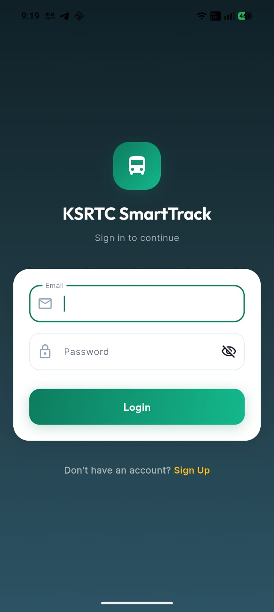
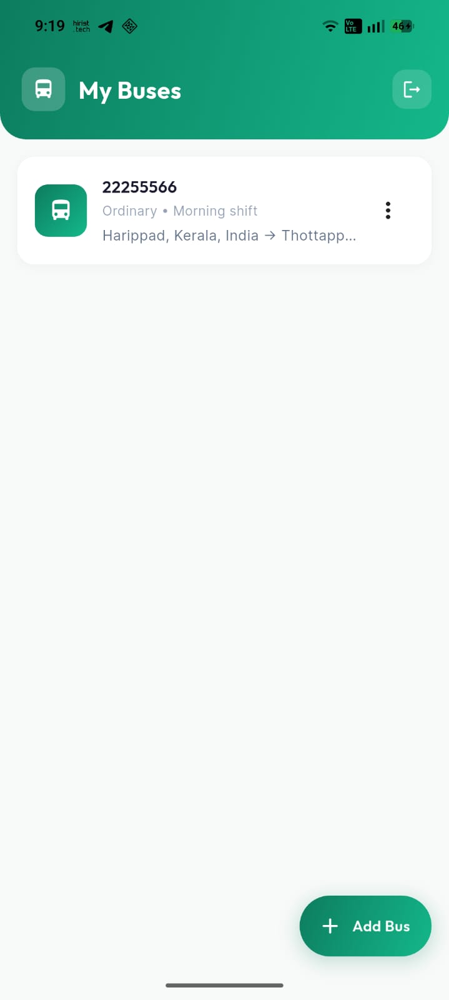
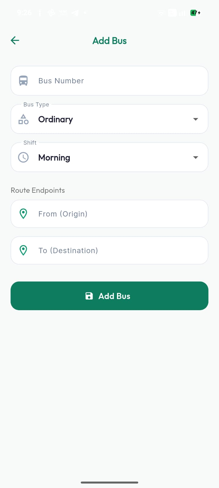
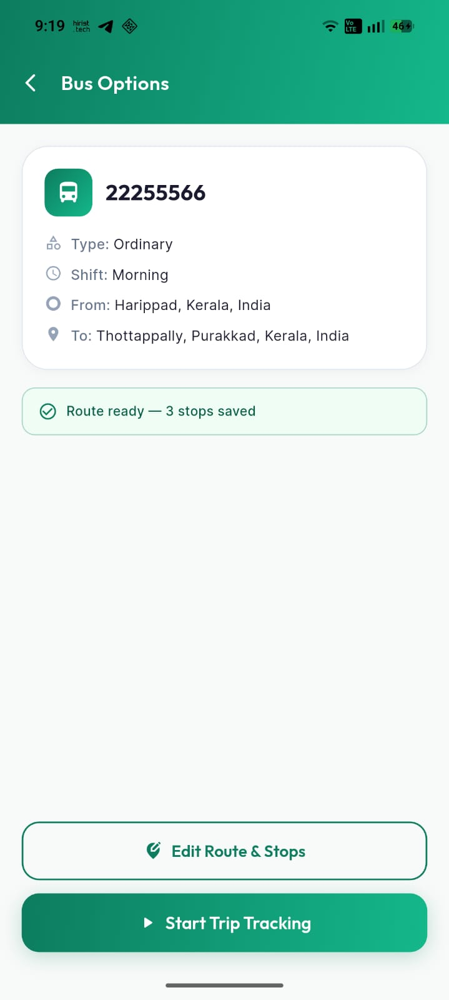
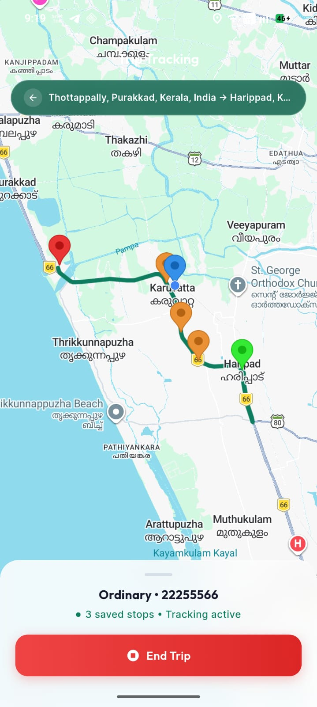
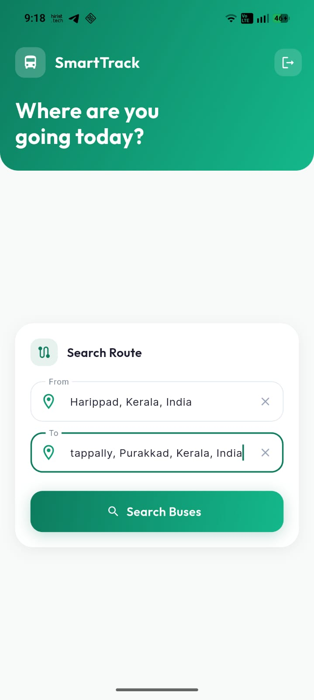
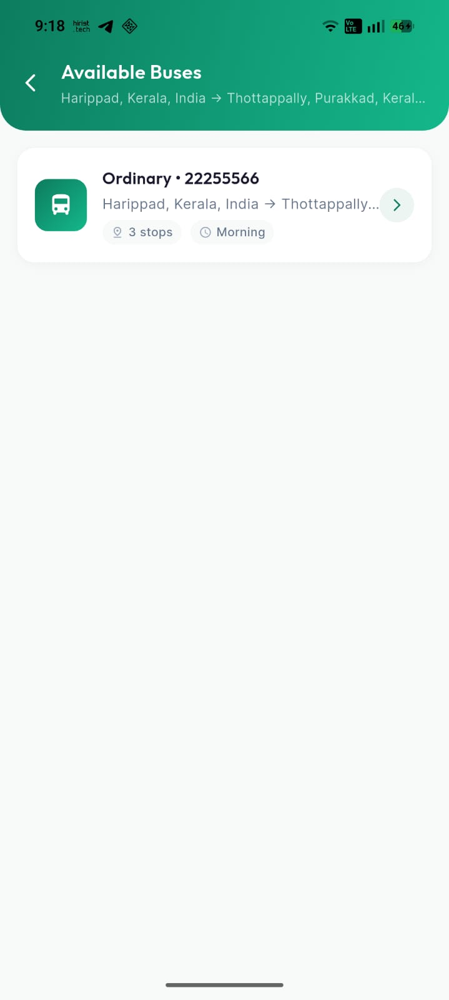
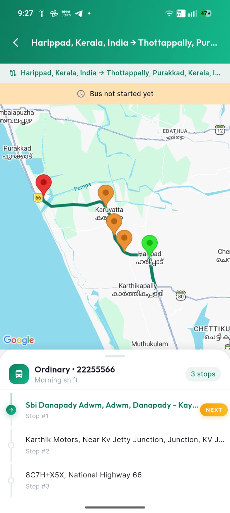

# 🚌 KSRTC SmartTrack

> **Real-time bus tracking system for KSRTC (Kerala State Road Transport Corporation)**
> Built with Flutter • Firebase • Google Maps

<p align="center">
  
</p>

---

## 📋 Overview

**KSRTC SmartTrack** is a dual-role mobile application that connects **bus conductors** and **passengers** in real time. Conductors manage buses, define routes, mark stops, and broadcast their live GPS position. Passengers search for routes, track buses on a live map, and receive voice-guided stop announcements — all powered by Firebase and Google Maps.

---

## ✨ Key Features

| Feature | Conductor | Passenger |
|---|:---:|:---:|
| Firebase Authentication (Email/Password) | ✅ | ✅ |
| Add / Edit / Delete buses | ✅ | — |
| Google Places Autocomplete for route endpoints | ✅ | ✅ |
| Route polyline preview on Google Maps | ✅ | ✅ |
| Live GPS broadcasting & tracking | ✅ | ✅ |
| Mark stops along the route | ✅ | — |
| Auto-detect travel direction (forward / return) | ✅ | ✅ |
| Real-time ETA calculation | — | ✅ |
| Voice announcements (TTS) at each stop | — | ✅ |
| Destination proximity alerts | — | ✅ |
| Premium glassmorphic UI with gradients | ✅ | ✅ |

---

## 🏗️ Architecture

```
lib/
├── core/
│   ├── constants/       # API keys, route names, bus types
│   └── theme/           # AppTheme — colors, gradients, typography
├── data/
│   ├── models/          # BusModel, TripModel, RouteModel, StopModel
│   └── repositories/    # TripRepository, BusRepository, AuthRepository
├── presentation/
│   ├── auth/            # Login & Sign-up screens
│   ├── conductor/       # Conductor-facing screens
│   │   ├── conductor_home_screen.dart
│   │   ├── add_edit_bus_screen.dart
│   │   ├── bus_options_screen.dart
│   │   ├── trip_tracking_screen.dart
│   │   ├── route_preview_screen.dart
│   │   └── live_tracking_screen.dart
│   ├── passenger/       # Passenger-facing screens
│   │   ├── search_screen.dart
│   │   ├── bus_results_screen.dart
│   │   └── bus_tracking_screen.dart
│   └── widgets/         # Shared reusable widgets
│       ├── location_search_field.dart
│       ├── stop_list_tile.dart
│       └── map_widget.dart
├── providers/           # Riverpod providers
├── services/            # TTS service
└── app.dart             # Root MaterialApp with splash
```

**State Management:** Flutter Riverpod  
**Backend:** Cloud Firestore (real-time streams)  
**Auth:** Firebase Authentication  
**Maps:** Google Maps Flutter + Directions API + Places API  
**Typography:** Google Fonts (Outfit / Inter)

---

## 🎨 Design System

| Token | Value |
|---|---|
| Primary | `#0D7C5F` (Deep Emerald) |
| Secondary | `#F59E0B` (Warm Amber) |
| Surface | `#F8FAFC` |
| Border Radius | `12px` / `16px` / `24px` |
| Shadows | Layered depth with primary glow |
| Glass Effect | `BackdropFilter` + semi-transparent fills |
| Fonts | **Outfit** (headings) · **Inter** (body) |

---

## 🚐 Conductor Flow

The conductor manages buses, starts trips, and marks stops in real time.

### Screenshots

<p align="center">
  
  &nbsp;&nbsp;
  
  &nbsp;&nbsp;
  
</p>

<p align="center">
  
</p>

### How It Works

1. **Add Bus** — Enter bus number, type (Ordinary/Fast/Super Fast), shift, and select origin/destination using Google Places autocomplete.
2. **Bus Options** — View bus details, edit route, or start a new trip.
3. **Route Preview** — See the polyline on Google Maps before starting. Previously saved stops are shown.
4. **Live Tracking** — GPS broadcasts every few seconds to Firestore. The conductor marks stops by tapping "Mark Stop" as the bus reaches each location.
5. **End Trip** — Marks the trip as completed and clears the active trip from the route document.

---

## 🧑‍🤝‍🧑 Passenger Flow

Passengers search for buses and track them in real time with voice announcements.

### Screenshots

<p align="center">
  
  &nbsp;&nbsp;
  
  &nbsp;&nbsp;
  
</p>

### How It Works

1. **Search Route** — Enter origin and/or destination. The app matches against all saved routes (forward AND reverse).
2. **Bus Results** — Shows all matching buses with type, shift, and route info. Active buses are highlighted.
3. **Live Tracking** — The bus location updates in real time on the map. An ordered stop list shows passed (grey), upcoming (green), and future stops.
4. **Voice Announcements** — TTS announces:
   - Current stop name when the bus arrives
   - Next stop name immediately after
   - Destination proximity alerts (2 stops away, next stop)
   - Arrival at destination
5. **ETA** — Calculates estimated time of arrival based on bus speed and remaining distance through stops.

---

## 🔥 Firebase Structure

```
Firestore
├── users/                 # User profile + role (conductor / passenger)
├── buses/                 # Bus metadata (busNumber, type, shift, route endpoints)
├── trips/                 # Active/completed trip documents with live GPS
│   └── {tripId}
│       ├── currentLat, currentLng, currentSpeed
│       ├── status (active / completed)
│       ├── passedStopOrders[]
│       └── stops[]
└── routes/                # Permanent route docs (1 per bus)
    └── {routeId}
        ├── busId, activeTripId
        ├── routePolyline (encoded)
        ├── fromPlace, toPlace (+ lowercase for search)
        └── stops[] (persisted across trips)
```

---

## 🛠️ Setup & Installation

### Prerequisites

- Flutter SDK `>=3.22.0`
- Android Studio / VS Code
- A Google Cloud project with:
  - **Maps SDK for Android** enabled
  - **Directions API** enabled
  - **Places API** enabled
  - **Billing enabled** (required for Places API — free $200/month credit)
- A Firebase project with:
  - **Authentication** (Email/Password)
  - **Cloud Firestore**

### Steps

```bash
# 1. Clone the repo
git clone https://github.com/sharukshajahan/ksrtc_smarttrack.git
cd ksrtc_smarttrack

# 2. Install dependencies
flutter pub get

# 3. Add your Firebase config
# Place google-services.json in android/app/
# Place GoogleService-Info.plist in ios/Runner/

# 4. Update API keys in lib/core/constants/app_constants.dart
# - directionsApiKey
# - placesApiKey

# 5. Run the app
flutter run
```

---

## 📦 Dependencies

| Package | Purpose |
|---|---|
| `flutter_riverpod` | State management |
| `cloud_firestore` | Real-time database |
| `firebase_auth` | Authentication |
| `google_maps_flutter` | Map rendering |
| `flutter_polyline_points` | Route polyline decoding |
| `geolocator` | GPS location access |
| `geocoding` | Reverse geocoding |
| `google_fonts` | Custom typography (Outfit, Inter) |
| `flutter_tts` | Text-to-speech announcements |
| `http` | REST API calls (Places, Directions) |
| `uuid` | Unique ID generation |

---

## 📱 Minimum Requirements

- **Android**: API 21+ (Lollipop)
- **iOS**: 14.0+
- **Flutter**: 3.22.0+

---

## 👤 Author

**Sharuk Shajahan**

---

## 📄 License

This project is licensed under the MIT License.
